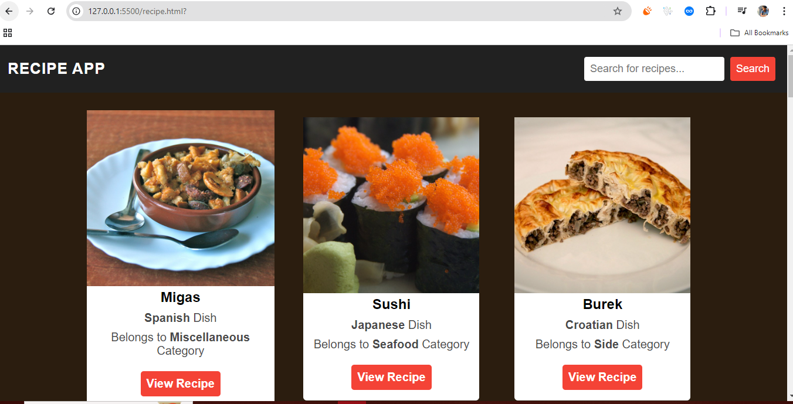

# 🍽️ Responsive Recipe App

A fully responsive Recipe App built using **vanilla web technologies**—HTML5, CSS3, and JavaScript. This project was developed as part of my self-driven front-end learning journey to simulate a real-world workflow and sharpen UI/UX design skills without relying on any frameworks or libraries.

## 🌟 Key Features

- 🔧 **Built with HTML5 & CSS3**: Semantic HTML and modern CSS (Flexbox, Grid) ensure a structured, scalable, and responsive layout across all screen sizes.
- 🎨 **Clean & Modern UI**: Carefully styled using CSS with hover effects, intuitive spacing, and a focus on user experience.
- 🔍 **Dynamic Search**: Search for recipes using keywords. JavaScript fetches data from a public recipe API and dynamically renders the content.
- 📱 **Responsive Design**: Works seamlessly on desktops, tablets, and smartphones.
- ⚙️ **DOM Interactions**: Implemented interactivity like recipe detail toggling using event listeners and DOM manipulation.

## 🛠️ Technologies Used

- HTML5  
- CSS3 (Flexbox & Grid)  
- JavaScript (ES6+)  
- Public Recipe API (Fetch API)

## 📂 Folder Structure

/recipe-app
├── index.html
├── style.css
├── script.js
└── README.md

## 📌 Learning Goals

- Practice real-world project structuring and development flow.
- Build an API-driven app with no external libraries.
- Strengthen skills in DOM manipulation, responsiveness, and UI consistency.

## ✨ ScreenShot

  

## ✨ Live Demo

🔗 [View Live App](https://go.screenpal.com/watch/cT1uQpnlns8)
